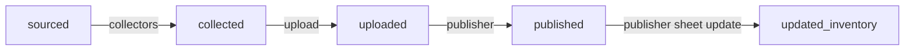
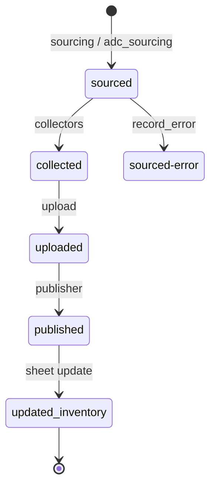
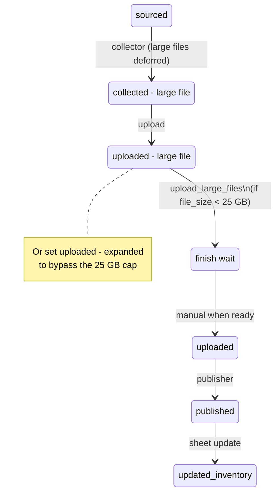
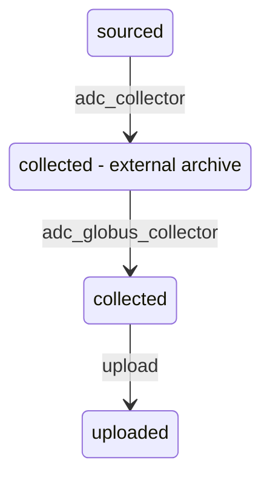
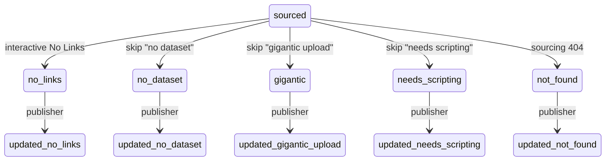
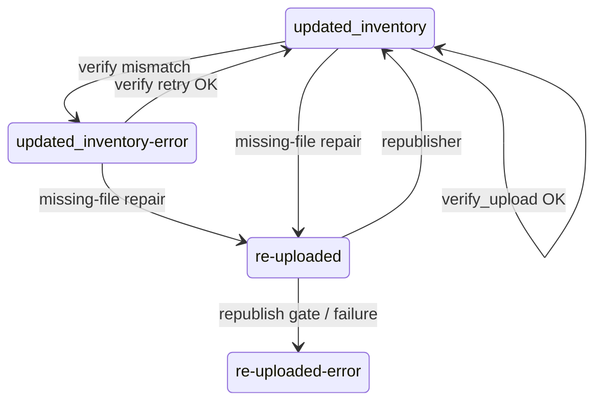

# Project status values

Every project row in the SQLite database has a `status` field. Modules use it to decide which projects are eligible to run, and they write a new status when they finish successfully. This page lists every status the pipeline uses today, what each means, and how projects move between them.

## How eligibility works

- A module’s **prerequisite** is an exact status string match (variants are not included unless the orchestrator lists them separately).
- By default, `list_eligible_projects` also requires an empty `errors` field. Projects with any text in `errors` are skipped.
- Exception: `verify_upload` also selects `updated_inventory-error` (including rows that still have errors) so failed verifications can be retried.

When a module fails via `record_error`, it usually sets status to `{previous_status}-error` and appends the message to `errors`. See [Error statuses](#error-statuses).

---

## Happy-path overview

Nodes are **status values** only. Edge labels are the modules that perform the transition.

Projects enter at `sourced` via `sourcing` / `adc_sourcing`. Large-file and repair side paths branch off this main line; see below.

---

## Status catalog

### Sourcing outcomes

| Status | Meaning | Typical next step |
|--------|---------|-------------------|
| `sourced` | Candidate URL accepted; ready for a collector. | Any collector (`cms_collector`, `usfs_collector`, `adc_collector`, `socrata_collector`, `catalog_collector`, `interactive_collector`, …). |
| `not_found` | Source URL returned 404 (or equivalent) during sourcing. | `publisher` (sheet-only update → `updated_not_found`). |
| `dupe_in_DL` | URL already exists in DataLumos; row kept for audit, not collected. | None (terminal unless manually changed). |
| `error` | Sourcing failed for a non-404 reason (network, parse, etc.). | Manual: clear errors / fix / set status. |

`adc_sourcing` creates rows at `sourced` (it does not use the spreadsheet 404 / DataLumos-dupe checks that spreadsheet `sourcing` does).

### Collection outcomes

| Status | Meaning | Typical next step |
|--------|---------|-------------------|
| `collected` | Files and metadata are on disk; ready to upload. | `upload` |
| `collected - large file` | Collected, but one or more large publication files were deferred (e.g. ADC/USFS). Small files may already be present. | `upload` → becomes `uploaded - large file` |
| `collected - external archive` | Dataset lives on an external host (e.g. Globus). Local folder may have metadata only. | `adc_globus_collector` / `adc_globus_survey` when Globus; otherwise hold / manual. Successful Globus transfer → `collected`. |
| `collected - file pending` | Hold variant: collection incomplete / download deferred. **Not** eligible for `upload`. | Manual follow-up; set to `collected` when ready. |
| `no_links` | Interactive collector: operator marked the page as having no usable download links. | `publisher` (sheet-only → `updated_no_links`). |
| `no dataset` | Interactive skip: no dataset to archive. | `publisher` (sheet-only → `updated_no_dataset`). |
| `gigantic upload` | Interactive skip: too large for normal upload workflow. | `publisher` (sheet-only → `updated_gigantic_upload`). |
| `needs scripting` | Interactive skip: needs custom automation later. | `publisher` (sheet-only → `updated_needs_scripting`). |

### Upload outcomes

| Status | Meaning | Typical next step |
|--------|---------|-------------------|
| `uploaded` | Project created in DataLumos; files uploaded; `datalumos_id` set. | `publisher` |
| `uploaded - large file` | Base project uploaded after `collected - large file`; large files still need a second pass. Eligible for `upload_large_files` only when `file_size` is present and **&lt; 25 GB**. | `upload_large_files` → `finish wait` |
| `uploaded - expanded` | Operator/process status for large-file upload at **any** `file_size` (no 25 GB cap). Not set automatically by the normal upload module. | `upload_large_files` → `finish wait` |
| `finish wait` | Large-file download/upload finished; waiting for human/process before publish. | Manual: typically set to `uploaded` when ready for `publisher`. |
| `re-uploaded` | Missing files were repaired by `verify_upload` (re-download + re-upload to existing workspace). | `republisher` |

### Publish and inventory outcomes

| Status | Meaning | Typical next step |
|--------|---------|-------------------|
| `published` | DataLumos publish workflow completed; `published_url` set. Transient if a sheet update follows immediately. | Google Sheet update (same `publisher` run when configured) → `updated_inventory` |
| `updated_inventory` | Inventory sheet updated with download location / claim fields; often the successful end state. Local folder may be deleted after this. | Optional: `verify_upload` to check DL vs DB inventory |
| `updated_not_found` | Sheet updated for a `not_found` project. | Terminal |
| `updated_no_links` | Sheet updated for a `no_links` project. | Terminal |
| `updated_no_dataset` | Sheet updated for a `no dataset` skip. | Terminal |
| `updated_gigantic_upload` | Sheet updated for a `gigantic upload` skip. | Terminal |
| `updated_needs_scripting` | Sheet updated for a `needs scripting` skip. | Terminal |

### Error statuses

| Status | Meaning |
|--------|---------|
| `error` | Generic / legacy failure (also used by sourcing). |
| `{status}-error` | Failure while the project was at `{status}`. Always written in **compact** form with no spaces: e.g. `sourced-error`, `uploaded-error`, `updated_inventory-error`, `re-uploaded-error`, `uploaded-large-file-error` (from `uploaded - large file`). |

`record_error` derives a compact `{previous}-error` unless the status is already `error` or already an error form. Spaced variants such as `sourced - error` or `uploaded - large file-error` are recognized as already-error and normalized to `sourced-error` / `uploaded-large-file-error`. The message is appended to the `errors` column, which blocks normal eligibility until cleared (MCP `clear_errors` / manual DB update).

`verify_upload` is the special case that **will** pick up `updated_inventory-error` for retry. On a clean verify it resets status to `updated_inventory` and clears `errors`. On successful missing-file repair it sets `re-uploaded` and clears `errors`.

---

## Transitions by module

| Module | Eligible statuses | Success status(es) |
|--------|-------------------|--------------------|
| `sourcing` | *(creates new rows)* | `sourced`, `not_found`, `dupe_in_DL`, or `error` |
| `adc_sourcing` | *(creates new rows)* | `sourced` |
| `*_collector` / `interactive_collector` | `sourced` | Usually `collected`; ADC/USFS may use `collected - large file` or `collected - external archive`; interactive may set `no_links` / skip presets |
| `adc_globus_collector` | `collected - external archive` (Globus URL in `status_notes`) | `collected` |
| `adc_globus_survey` | `collected - external archive` (Globus) | *(survey only; does not advance to upload)* |
| `upload` | `collected`, `collected - large file` | `uploaded` or `uploaded - large file` |
| `upload_large_files` | `uploaded - large file` (&lt; 25 GB), `uploaded - expanded` (any size) | `finish wait` |
| `publisher` | `uploaded`, plus sheet-only: `not_found`, `no_links`, `no dataset`, `gigantic upload`, `needs scripting` | `published` then `updated_inventory` (browser path); or `updated_*` (sheet-only path) |
| `verify_upload` | `updated_inventory`, `updated_inventory-error` | Unchanged on match; `re-uploaded` on repair; `updated_inventory-error` on mismatch; retry success → `updated_inventory` |
| `republisher` | `re-uploaded` | `updated_inventory` (V2 URL / republish note) |

---

## Detailed transition diagrams

### Main collect → publish path

### Large-file path (ADC / USFS)

### External archive (Globus)

### Interactive skips and sheet-only publish

### Verify / repair / republish

---

## Practical notes

1. **Exact strings matter.** `collected` ≠ `collected - large file`. The orchestrator merges lists when a module intentionally accepts more than one status.
2. **Errors block progress.** Clearing `errors` (and often rolling status back, e.g. to `sourced`) is required before most modules will see the project again.
3. **`published` is often brief.** When Google Sheets is configured, `publisher` advances to `updated_inventory` in the same run after a successful sheet write.
4. **`finish wait` is not auto-published.** After `upload_large_files`, an operator decides when the project should become `uploaded` for `publisher`.
5. **`dupe_in_DL` and the `updated_*` terminal statuses** normally end the automated pipeline for that row.
6. **Manual overrides** (`set_project_status`, SQL, MCP) are supported for recovery; prefer documenting why in `status_notes` / `warnings` when you do.

---

## Related docs

- [Usage](Usage.md) — how to run modules and recover stuck projects
- [README](../README.md) — module overview
- Orchestrator registry: `orchestration/Orchestrator.py` (`MODULES` and multi-status branches)
