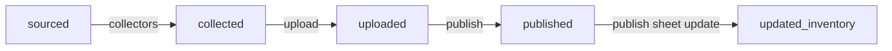
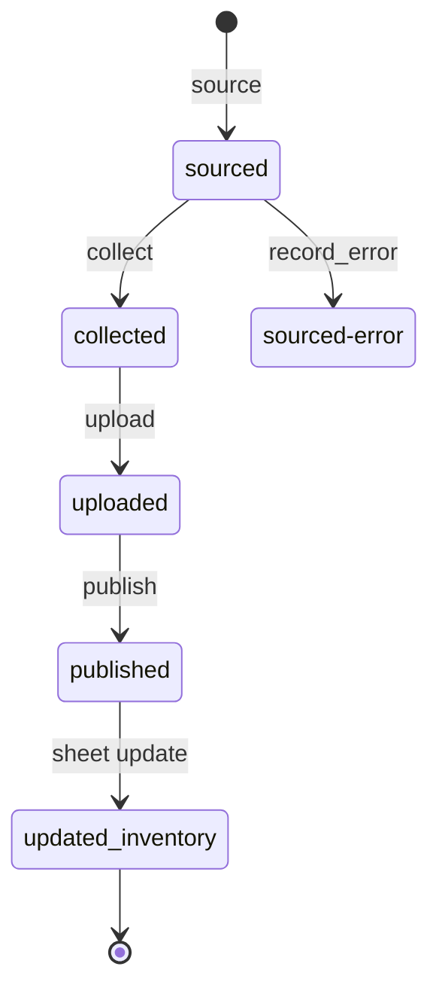
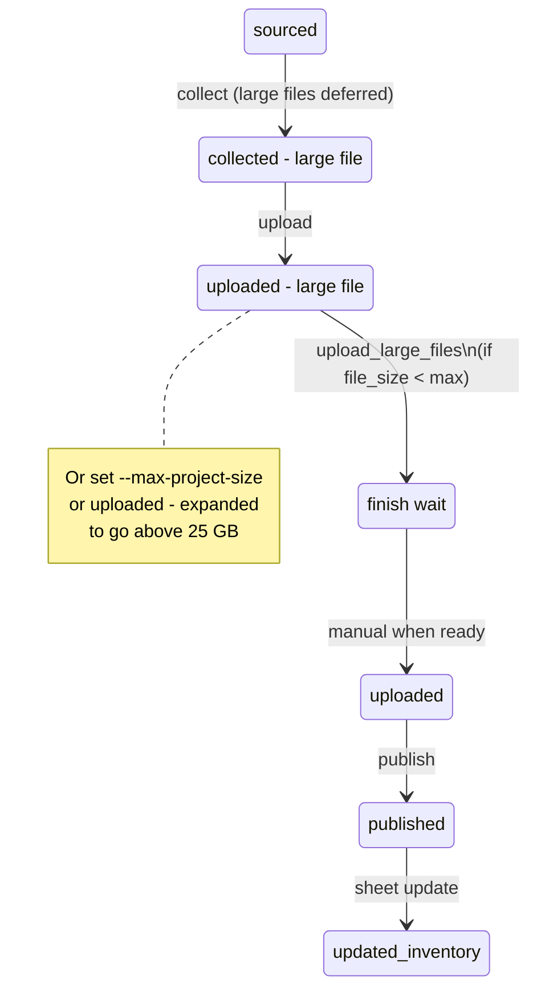
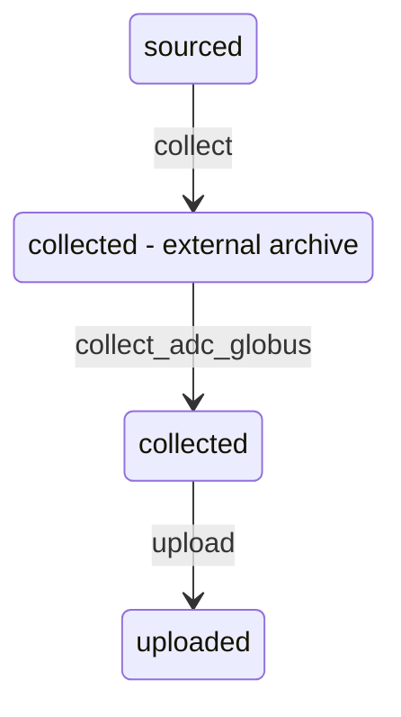
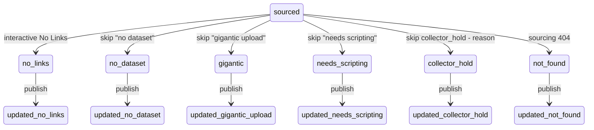
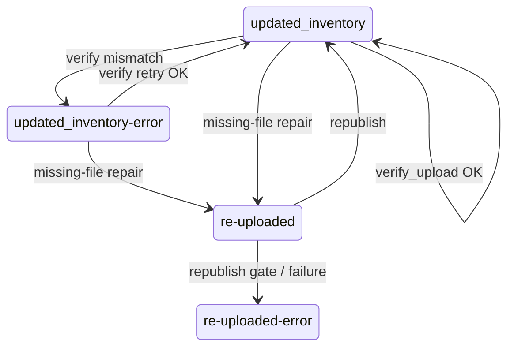

# Project status values

Every project row in the SQLite database has a `status` field. Modules use it to decide which projects are eligible to run, and they write a new status when they finish successfully. `next_step`, stored immediately after `status`, is advisory. It names the module to run next, or the status the operator should set next (`resize wait`, `resized`, `uploaded`). It is `?` when that is not clear, and null when the row is finished. `last_change`, stored immediately after `next_step`, is the local time (`YYYY-MM-DD HH:MM:SS`) of the last module that created, updated, or finished that project. Rows that have not been processed yet leave it null.

## How eligibility works

- A module’s **prerequisite** is an exact status string match (variants are not included unless the orchestrator lists them separately).
- By default, `list_eligible_projects` also requires an empty `errors` field. Projects with any text in `errors` are skipped.
- Exception: `verify_upload` also selects `updated_inventory-error` (including rows that still have errors) so failed verifications can be retried.

When a module fails via `record_error`, it usually sets status to `{previous_status}-error` and appends the message to `errors`. See [Error statuses](#error-statuses).

---

## Happy-path overview

Nodes are **status values** only. Edge labels are the modules that perform the transition.


```mermaid
flowchart LR
  sourced -->|collectors| collected
  collected -->|upload| uploaded
  uploaded -->|publish| published
  published -->|publish sheet update| updated_inventory
```

Projects enter at `sourced` via `source`. Large-file and repair side paths branch off this main line; see below.

---

## Status catalog

### Sourcing outcomes

| Status | Meaning | Typical next step |
|--------|---------|-------------------|
| `sourced` | Candidate URL accepted; ready for a collector. | `collect` or `collect_interactively`. |
| `not_found` | Source URL returned 404 (or equivalent) during sourcing. | `publish` (sheet-only update → `updated_not_found`). |
| `dupe_in_DL` | URL already exists in DataLumos; row kept for audit, not collected. | None (terminal unless manually changed). |
| `error` | Sourcing failed for a non-404 reason (network, parse, etc.). | Manual: clear errors / fix / set status. |

`adc_sourcing` creates rows at `sourced` (it does not use the spreadsheet 404 / DataLumos-dupe checks that spreadsheet `source` does).

### Collection outcomes

| Status | Meaning | Typical next step |
|--------|---------|-------------------|
| `collected` | Files and metadata are on disk; ready to upload. | `upload` |
| `collected - large` | Collected under the 1 GiB budget. Total inventory is over 1 GiB and under 25 GiB. Remaining files are in `project_files`. | `upload` → `uploaded - large` |
| `collected - xlarge` | Total inventory is at least 25 GiB, or a file size is unknown. | `upload` → `uploaded - xlarge` |
| `collected - large file` | Legacy status. Leftover rows stay on `upload_large_files` after upload. | `upload` → `uploaded - large file` |
| `collected - external archive` | Dataset lives on an external host (e.g. Globus). Local folder may have metadata only. | `collect_adc_globus` / `survey_adc_globus` when Globus; otherwise hold / manual. Successful Globus transfer → `collected`. |
| `collected - file pending` | Hold variant: collection incomplete / download deferred. **Not** eligible for `upload`. | Manual follow-up; set to `collected` when ready. |
| `no_links` | Interactive collector: operator marked the page as having no usable download links. | `publish` (sheet-only → `updated_no_links`). |
| `no dataset` | Interactive skip: no dataset to archive. | `publish` (sheet-only → `updated_no_dataset`). |
| `gigantic upload` | Interactive skip: too large for normal upload workflow. | `publish` (sheet-only → `updated_gigantic_upload`). |
| `needs scripting` | Interactive skip: needs custom automation later. | `publish` (sheet-only → `updated_needs_scripting`). |
| `collector_hold - {reason}` | Interactive skip with a free-text reason (legacy: `collector hold - {reason}`). | `publish` (sheet-only → `updated_collector_hold`; Notes = `{reason}`). |

### Upload outcomes

| Status | Meaning | Typical next step |
|--------|---------|-------------------|
| `uploaded` | Project created in DataLumos; files uploaded; `datalumos_id` set. ZIP imports may still be unpacking. | `publish` |
| `uploaded - large` | First upload of a large project. Deferred files are still on the source site. | `resume_download` → `downloaded` |
| `uploaded - xlarge` | First upload of an xlarge project. Waiting for the operator to request a DataLumos size increase. | Operator sets `resize wait` |
| `resize wait` | Size increase has been requested. | Operator sets `resized` |
| `resized` | DataLumos limit was raised. | `resume_download` → `downloaded` |
| `downloaded` | Deferred files are on disk. | `resume_upload` → `finish wait` |
| `uploaded - large file` | Legacy. Eligible for `upload_large_files` when `file_size` is below `--max-project-size` (default **25 GB**). | `upload_large_files` → `finish wait` |
| `uploaded - expanded` | Legacy operator status for `upload_large_files` at any size. | `upload_large_files` → `finish wait` |
| `finish wait` | Deferred files have been uploaded. | Operator sets `uploaded`, then `publish` |
| `re-uploaded` | Missing files were repaired by `verify_upload` (re-download + re-upload to existing workspace). | `republish` |

### Publish and inventory outcomes

| Status | Meaning | Typical next step |
|--------|---------|-------------------|
| `published` | DataLumos publish workflow completed; `published_url` set. Transient if a sheet update follows immediately. | Google Sheet update (same `publish` run when configured) → `updated_inventory` |
| `updated_inventory` | Inventory sheet updated with download location / claim fields; often the successful end state. Local folder may be deleted after this. | Optional: `verify_upload` to check DL vs DB inventory |
| `updated_not_found` | Sheet updated for a `not_found` project. | Terminal |
| `updated_no_links` | Sheet updated for a `no_links` project. | Terminal |
| `updated_no_dataset` | Sheet updated for a `no dataset` skip. | Terminal |
| `updated_gigantic_upload` | Sheet updated for a `gigantic upload` skip. | Terminal |
| `updated_needs_scripting` | Sheet updated for a `needs scripting` skip. | Terminal |
| `updated_collector_hold` | Sheet updated for a `collector_hold - {reason}` project (Notes = reason). | Terminal |

### Error statuses

| Status | Meaning |
|--------|---------|
| `error` | Generic / legacy failure (also used by source). |
| `{status}-error` | Failure while the project was at `{status}`. Always written in **compact** form with no spaces: e.g. `sourced-error`, `uploaded-error`, `updated_inventory-error`, `re-uploaded-error`, `uploaded-large-file-error` (from `uploaded - large file`). |

`record_error` derives a compact `{previous}-error` unless the status is already `error` or already an error form. Spaced variants such as `sourced - error` or `uploaded - large file-error` are recognized as already-error and normalized to `sourced-error` / `uploaded-large-file-error`. Each failure is appended to the `errors` column as its own block, one `name: value` line per field:

```
description: Download failed
drpid: 12
datalumos_id: 34567
timestamp: 2026-10-04 17:49:00
module: collect
details: Download failed: report.csv - https://example.com/report.csv
```

`description` is the text before the first `: ` when that prefix is short; otherwise it matches `details`. `datalumos_id` is empty when the project has none. `timestamp` is local time. `module` is the pipeline module that was running, or the script file name. A blank line separates blocks. Any text in `errors` blocks normal eligibility until cleared (MCP `clear_errors` / manual DB update).

To re-run a module against error statuses from the CLI, use ``--retry`` (selects `<prereq>-error`, ignores the errors field, restores the base status for the run, and clears `errors` on success). Combine with ``--ids 5,10-12`` to limit which DRPIDs are retried.

`verify_upload` is the special case that **will** pick up `updated_inventory-error` for retry. On a clean verify it resets status to `updated_inventory` and clears `errors`. On successful missing-file repair it sets `re-uploaded` and clears `errors`.

---

## Transitions by module

| Module | Eligible statuses | Success status(es) |
|--------|-------------------|--------------------|
| `source` | *(creates new rows)* | `sourced`, `not_found`, `dupe_in_DL`, or `error` |
| `collect` / `collect_interactively` | `sourced` | Usually `collected`; ADC/USFS may use `collected - large file` or `collected - external archive`; interactive may set `no_links` / skip presets |
| `collect_adc_globus` | `collected - external archive` (Globus URL in `status_notes`) | `collected` |
| `survey_adc_globus` | `collected - external archive` (Globus) | *(survey only; does not advance to upload)* |
| `upload` | `collected - xlarge`, then `collected - large`, then `collected - large file`, then `collected` | `uploaded`, `uploaded - large`, `uploaded - xlarge`, or legacy `uploaded - large file` |
| `resume_download` | `uploaded - large`, `resized` | `downloaded` |
| `resume_upload` | `downloaded` | `finish wait` |
| `upload_large_files` | `uploaded - large file` (below `--max-project-size`, default 25 GB), `uploaded - expanded` (any size) | `finish wait` |
| `publish` | `uploaded`. Plus sheet-only: `not_found`, `no_links`, `no dataset`, `gigantic upload`, `needs scripting`, `collector_hold - *` | `published` then `updated_inventory` (browser path); or `updated_*` (sheet-only path) |
| `verify_upload` | `updated_inventory`, `updated_inventory-error` | Unchanged on match; `re-uploaded` on repair; `updated_inventory-error` on mismatch; retry success → `updated_inventory` |
| `republish` | `re-uploaded` | `updated_inventory` (V2 URL / republish note) |

---

## Detailed transition diagrams

### Main collect → publish path


```mermaid
stateDiagram-v2
  [*] --> sourced: source
  sourced --> collected: collect
  sourced --> sourced_error: record_error
  sourced_error: sourced-error
  collected --> uploaded: upload
  uploaded --> published: publish
  published --> updated_inventory: sheet update
  updated_inventory --> [*]
```

### Large-file path (ADC / USFS)


```mermaid
stateDiagram-v2
  sourced --> collected_lf: collect (large files deferred)
  collected_lf: collected - large file
  collected_lf --> uploaded_lf: upload
  uploaded_lf: uploaded - large file
  uploaded_lf --> finish_wait: upload_large_files\n(if file_size < max)
  finish_wait: finish wait
  finish_wait --> uploaded: manual when ready
  uploaded --> published: publish
  published --> updated_inventory: sheet update

  note right of uploaded_lf
    Or set --max-project-size
    or uploaded - expanded
    to go above 25 GB
  end note
```

### External archive (Globus)


```mermaid
stateDiagram-v2
  sourced --> external: collect
  external: collected - external archive
  external --> collected: collect_adc_globus
  collected --> uploaded: upload
```

### Interactive skips and sheet-only publish


```mermaid
stateDiagram-v2
  sourced --> no_links: interactive No Links
  sourced --> no_dataset: skip "no dataset"
  sourced --> gigantic: skip "gigantic upload"
  sourced --> needs_scripting: skip "needs scripting"
  sourced --> collector_hold: skip collector_hold - reason
  sourced --> not_found: sourcing 404

  no_links --> updated_no_links: publish
  no_dataset --> updated_no_dataset: publish
  gigantic --> updated_gigantic_upload: publish
  needs_scripting --> updated_needs_scripting: publish
  collector_hold --> updated_collector_hold: publish
  not_found --> updated_not_found: publish
```

### Verify / repair / republish


```mermaid
stateDiagram-v2
  updated_inventory --> updated_inventory: verify_upload OK
  updated_inventory --> inventory_error: verify mismatch
  inventory_error: updated_inventory-error
  inventory_error --> updated_inventory: verify retry OK
  inventory_error --> re_uploaded: missing-file repair
  updated_inventory --> re_uploaded: missing-file repair
  re_uploaded: re-uploaded
  re_uploaded --> updated_inventory: republish
  re_uploaded --> re_uploaded_error: republish gate / failure
  re_uploaded_error: re-uploaded-error
```

---

## Practical notes

1. **Exact strings matter.** `collected` ≠ `collected - large file`. The orchestrator merges lists when a module intentionally accepts more than one status.
2. **Errors block progress.** Clearing `errors` (and often rolling status back, e.g. to `sourced`) is required before most modules will see the project again.
3. **`published` is often brief.** When Google Sheets is configured, `publish` advances to `updated_inventory` in the same run after a successful sheet write.
4. **`finish wait` is not auto-published.** After `resume_upload`, `next_step` is `uploaded`. The operator sets that status, and then `publish` can run.
5. **`dupe_in_DL` and the `updated_*` terminal statuses** normally end the automated pipeline for that row.
6. **Manual overrides** (`set_project_status`, SQL, MCP) are supported for recovery; prefer documenting why in `status_notes` / `warnings` when you do.

---

## Related docs

- [Usage](Usage.md) — how to run modules and recover stuck projects
- [README](../README.md) — module overview
- Orchestrator registry: `orchestration/Orchestrator.py` (`MODULES` and multi-status branches)
